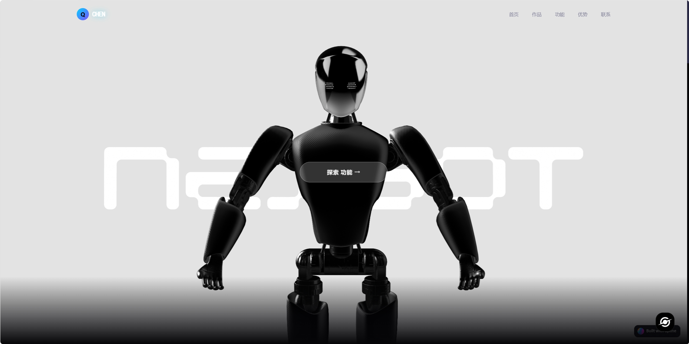
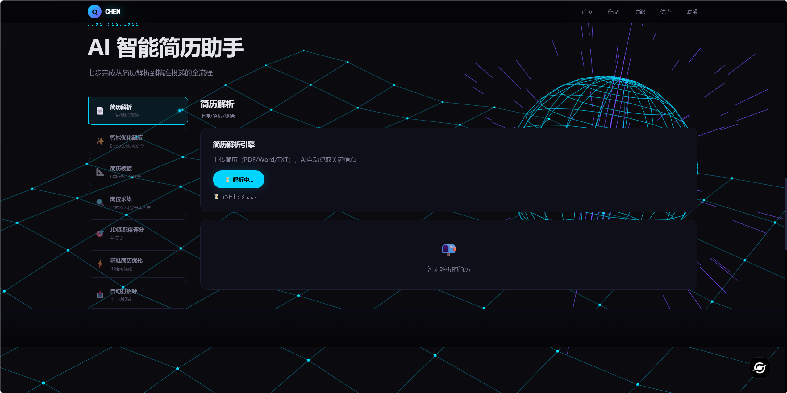
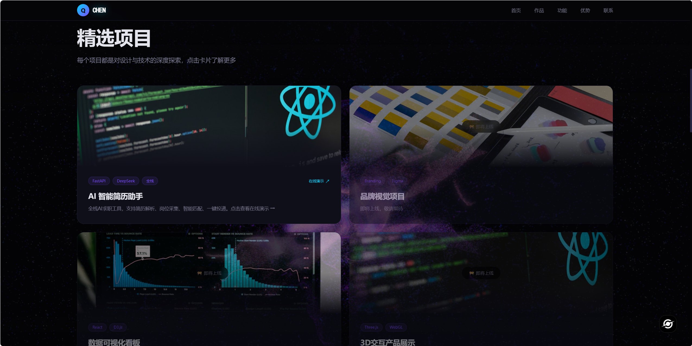
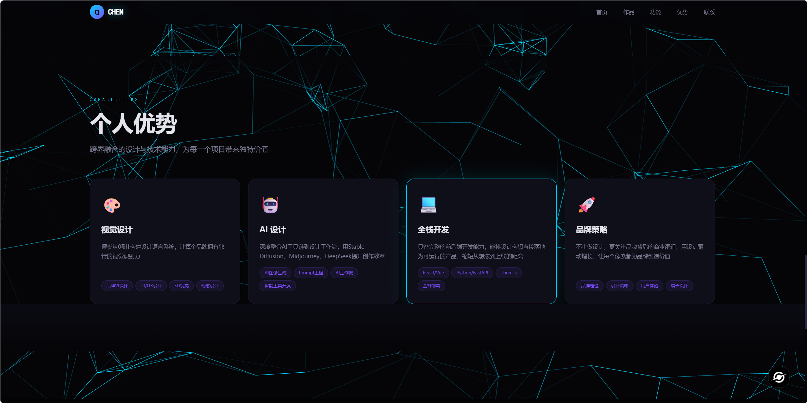

# AI 智能简历助手

> 全栈 AI 求职工具——从简历解析、岗位采集、智能匹配到一键投递，覆盖求职全流程。
> 
> 🎥 [查看演示视频](#)

---
## 📸 项目截图









---

## ✨ 核心功能

| 模块 | 说明 |
|------|------|
| 📄 简历解析 | 上传 PDF/Word/TXT，AI 自动提取姓名、学历、工作经历、技能等结构化信息 |
| ✨ 智能优化 | DeepSeek AI 对你的简历进行语言润色和内容优化 |
| 📐 简历模板 | 6 套精美模板（经典/现代/双栏/科技/中国风/极简），一键生成排版 |
| 🔍 岗位采集 | Playwright 自动抓取 51job 等招聘网站岗位信息 |
| 🎯 JD 匹配评分 | AI 语义匹配简历与岗位描述，输出匹配度分数和优化建议 |
| ⚡ 精准优化 | 针对高分岗位 JD 定向优化简历，提高通过率 |
| 📤 自动打招呼 | 半自动投递系统，内置反检测策略（随机延迟/日限额/冷却期） |

---
## 🛠 技术栈

**后端**: Python 3.12 · FastAPI · Uvicorn · WebSocket  
**AI**: DeepSeek API（OpenAI 兼容协议）· Prompt Engineering  
**自动化**: Playwright · 浏览器反检测  
**数据处理**: Pandas · openpyxl · ReportLab（PDF 生成）· python-docx  
**前端**: React 18（CDN）· Babel Standalone（JSX）· Vanta.js（3D 背景）· Spline

---
## 📁 项目结构

```
AI_one/
├── app.py                # FastAPI 后端主程序（路由/WebSocket/业务逻辑）
├── server.py             # 前端静态文件服务器
├── config.py             # 全局配置（API Key/投递策略/日志）
├── requirements.txt      # Python 依赖清单
├── 一键启动.bat            # 一键启动脚本（后端+前端+内网穿透）
├── .env                  # 环境变量（API Key等敏感信息）
├── modules/              # 核心功能模块
│   ├── deepseek_client.py    # DeepSeek API 调用封装
│   ├── job_scraper.py        # 岗位爬虫（Playwright）
│   ├── resume_parser.py      # 简历解析引擎
│   └── jd_matcher.py         # JD 匹配评分算法
├── src/                  # 前端源码（React JSX 组件）
│   ├── App.jsx
│   └── components/
│       ├── AIAssistant.jsx   # 核心功能面板
│       ├── Navbar.jsx        # 导航栏
│       ├── Hero.jsx          # 首屏展示
│       ├── Projects.jsx      # 项目卡片
│       ├── Strengths.jsx     # 个人优势
│       └── Footer.jsx        # 页脚
├── static/               # 静态资源（CSS）
├── data/                 # 运行时数据（简历JSON/岗位JSON/投递历史）
├── resumes/              # 上传的简历原始文件
├── logs/                 # 运行日志
└── photos/               # 证件照
```

---
## 📝 开发日志

本项目由非程序员使用 AI 辅助编程（Codex）从零独立完成，完整记录了：

- **Codex工作日志.txt** — 每次迭代的需求、思路、步骤、结果
- **全局复利踩坑日志.txt** — 所有报错、根因、修复方案，避免重复踩坑
- **规矩日志.txt** — 给 AI 定的协作规范（自检/清理/不越界）

> 这证明了 **"产品思维 + AI 协作 = 独立交付完整产品"** 的可行性。

---
## 👤 作者

陈其锋 · 2026 届毕业生 · 大数据技术专业

求职方向：AI 产品运营 / 新媒体运营（技术向） / Prompt Engineer

---
*最后更新：2026-06-09*


